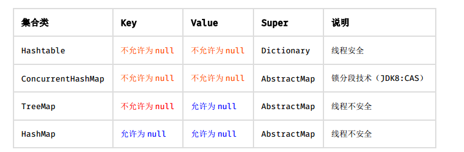

### 编程规约
#### 命名风格
 - 代码中的命名均不能以**下划线或美元符号**开始，也不能以**下划线或美元符号**结束。

```java
反例：
_name / __name / $name / name_ / name$ / name__
```
 - 代码中的命名严禁使用拼音与英文混合的方式，更不允许直接使用中文的方式
   - **说明**：正确的英文拼写和语法可以让阅读者易于理解，避免歧义。
 - 类名使用**UpperCamelCase**风格，但以下情形例外
   - **DO BO DTO VO AO PO UID等等**
 - 方法名、参数名、成员变量、局部变量都统一使用**lowerCamelCase**风格，必须遵从驼峰形式
 - 常量命名全部大写，单词间用下划线隔开
 - 抽象类命名使用**Abstract**或**Base**开头；异常类命名使用**Exception**结尾；
 测试类命名以它要测试的类的名称开始，以**Test**结尾。
 - 类型与中括号紧挨相连来表示数据。
 - POJO类中布尔类型的变量，都不要加**is**前缀，否则部分框架解析会引起序列化错误
 - 包名统一使用小写，点分隔符之间有且仅有一个自然语义的英语单词。包名统一使用
   **单数**形式，但是类名如果有复数含义，类名可以使用复数形式
 - 杜绝完全不规范的缩写， 避免望文不知义。
 - 为了达到代码自解释的目标，任何自定义编程元素在命名时，使用尽量完整的单词
   组合来表达其意。
 - 如果模块、 接口、类、方法使用了设计模式，在命名时需体现出具体模式。
    -  说明： 将设计模式体现在名字中，有利于阅读者快速理解架构设计理念。
 - 接口类中的方法和属性不要加任何修饰符号（public 也不要加） ，保持代码的简洁
   性，并加上有效的 Javadoc 注释。尽量不要在接口里定义变量，如果一定要定义变量，肯定是
   与接口方法相关，并且是整个应用的基础常量。
 - 接口和实现类的命名有两套规则：
    - 对于 Service 和 DAO 类，基于 SOA 的理念，暴露出来的服务一定是接口，内部
      的实现类用 Impl 的后缀与接口区别。
    - 如果是形容能力的接口名称，取对应的形容词为接口名（通常是–able 的形式）。
 - 枚举类名建议带上 Enum 后缀，枚举成员名称需要全大写，单词间用下划线隔开。
 - 各层命名规约：
    - Service/DAO 层方法命名规约
        - 获取单个对象的方法用 get 做前缀。
        - 获取多个对象的方法用 list 做前缀，复数形式结尾如： listObjects。
        - 获取统计值的方法用 count 做前缀。
        - 插入的方法用 save/insert 做前缀。
        - 删除的方法用 remove/delete 做前缀。
        - 修改的方法用 update 做前缀。
    - 领域模型命名规约
        - 数据对象： xxxDO， xxx 即为数据表名。
        - 数据传输对象： xxxDTO， xxx 为业务领域相关的名称。
        - 展示对象： xxxVO， xxx 一般为网页名称。
        - POJO 是 DO/DTO/BO/VO 的统称，禁止命名成 xxxPOJO。

#### 常量定义

   - 不允许任何魔法值（即未经预先定义的常量） 直接出现在代码中。
   - 在 long 或者 Long 赋值时， 数值后使用大写的 L，不能是小写的 l，小写容易跟数字
   1 混淆，造成误解。
   - 不要使用一个常量类维护所有常量， 要按常量功能进行归类，分开维护。
   - 常量的复用层次有五层：跨应用共享常量、应用内共享常量、子工程内共享常量、包
     内共享常量、类内共享常量。
        - 跨应用共享常量：放置在二方库中，通常是 client.jar 中的 constant 目录下。
        - 应用内共享常量：放置在一方库中， 通常是子模块中的 constant 目录下。
        - 子工程内部共享常量：即在当前子工程的 constant 目录下。
        - 包内共享常量：即在当前包下单独的 constant 目录下。
        - 类内共享常量：直接在类内部 private static final 定义。
   - 如果变量值仅在一个固定范围内变化用 enum 类型来定义。
   ```java
   正例：
   public enum SeasonEnum {
       SPRING(1), SUMMER(2), AUTUMN(3), WINTER(4);
       private int seq;
       SeasonEnum(int seq){
       this.seq = seq;
       }
   }
   ```

#### 代码格式
   - 大括号的使用约定。如果是大括号内为空，则简洁地写成{}即可，不需要换行； 如果
     是非空代码块则：
        - 左大括号前不换行。
        - 左大括号后换行。
        - 右大括号前换行。
        - 右大括号后还有 else 等代码则不换行； 表示终止的右大括号后必须换行。
   - 左小括号和字符之间不出现空格； 同样，右小括号和字符之间也不出现空格；而左大
     括号前需要空格。
   - if/for/while/switch/do 等保留字与括号之间都必须加空格。
   - 任何二目、 三目运算符的左右两边都需要加一个空格。 运算符包括赋值运算符=、逻辑运算符&&、加减乘除符号等。
   - 采用 4 个空格缩进，禁止使用 tab 字符。
   ```java
   正例： （涉及 1-5 点）
   public static void main(String[] args) {
       // 缩进 4 个空格
       String say = "hello";
       // 运算符的左右必须有一个空格
       int flag = 0;
       // 关键词 if 与括号之间必须有一个空格，括号内的 f 与左括号， 0 与右括号不需要空格
       if (flag == 0) {
           System.out.println(say);
       }
       // 左大括号前加空格且不换行；左大括号后换行
       if (flag == 1) {
           System.out.println("world");
           // 右大括号前换行，右大括号后有 else，不用换行
           } else {
           System.out.println("ok");
           // 在右大括号后直接结束，则必须换行
       }
   }
   ```
   - 注释的双斜线与注释内容之间有且仅有一个空格。
   - 单行字符数限制不超过 120 个，超出需要换行，换行时遵循如下原则
        - 第二行相对第一行缩进 4 个空格，从第三行开始，不再继续缩进，参考示例。
        - 运算符与下文一起换行。
        - 方法调用的点符号与下文一起换行。
        - 方法调用中的多个参数需要换行时， 在逗号后进行。
        - 在括号前不要换行，见反例。
   ```java
   正例：
   StringBuffer sb = new StringBuffer();
   // 超过 120 个字符的情况下，换行缩进 4 个空格， 点号和方法名称一起换行
   sb.append("zi").append("xin")...
       .append("huang")...
       .append("huang")...
       .append("huang");

   反例：
   StringBuffer sb = new StringBuffer();
   // 超过 120 个字符的情况下，不要在括号前换行
   sb.append("zi").append("xin")...append
       ("huang");
   // 参数很多的方法调用可能超过 120 个字符， 不要在逗号前换行
   method(args1, args2, args3, ...
       , argsX);
   ```
   - 方法参数在定义和传入时，多个参数逗号后边必须加空格。
   -  IDE 的 text file encoding 设置为 UTF-8; IDE 中文件的换行符使用 Unix 格式，
     不要使用 Windows 格式。
   - 单个方法的总行数不超过 80 行。
   - 没有必要增加若干空格来使某一行的字符与上一行对应位置的字符对齐。
   - 不同逻辑、不同语义、不同业务的代码之间插入一个空行分隔开来以提升可读性。

#### OOP规约
   - 避免通过一个类的对象引用访问此类的静态变量或静态方法，无谓增加编译器解析成
     本，直接用类名来访问即可。
   - 所有的覆写方法，必须加@Override 注解。
   - 相同参数类型，相同业务含义，才可以使用 Java 的可变参数，避免使用 Object。
   - 外部正在调用或者二方库依赖的接口，不允许修改方法签名，避免对接口调用方产生
     影响。接口过时必须加@Deprecated 注解，并清晰地说明采用的新接口或者新服务是什么。
   - 不能使用过时的类或方法。
   - Object 的 equals 方法容易抛空指针异常，应使用常量或确定有值的对象来调用
     equals。
   ```java
   正例： "test".equals(object);
   反例： object.equals("test");
   说明： 推荐使用 java.util.Objects#equals（JDK7 引入的工具类）
   ```
   - 所有的相同类型的包装类对象之间值的比较，全部使用 equals 方法比较。
   - 关于基本数据类型与包装数据类型的使用标准如下：
        - 所有的 POJO 类属性必须使用包装数据类型。
        - RPC 方法的返回值和参数必须使用包装数据类型。
        - 所有的局部变量使用基本数据类型。
   - 定义 DO/DTO/VO 等 POJO 类时，不要设定任何属性**默认值**。
   - 序列化类新增属性时，请不要修改 serialVersionUID 字段，避免反序列失败； 如
     果完全不兼容升级，避免反序列化混乱，那么请修改 serialVersionUID 值。
   - 构造方法里面禁止加入任何业务逻辑，如果有初始化逻辑，请放在 init 方法中。
   - POJO 类必须写 toString 方法。使用 IDE 中的工具： source> generate toString
     时，如果继承了另一个 POJO 类，注意在前面加一下 **super.toString**。
   - 禁止在 POJO 类中，同时存在对应属性 xxx 的 isXxx()和 getXxx()方法。
   - 使用索引访问用 String 的 split 方法得到的数组时，需做最后一个分隔符后有无
     内容的检查，否则会有抛 IndexOutOfBoundsException 的风险。

   ```java
   说明：
   String str = "a,b,c,,";
   String[] ary = str.split(",");
   // 预期大于 3，结果是 3
   System.out.println(ary.length);
   ```
   - 当一个类有多个构造方法，或者多个同名方法，这些方法应该按顺序放置在一起，
     便于阅读
   - 类内方法定义的顺序依次是：公有方法或保护方法 > 私有方法 > getter/setter
     方法。
   - setter 方法中，参数名称与类成员变量名称一致， this.成员名 = 参数名。在
     getter/setter 方法中， 不要增加业务逻辑，增加排查问题的难度。
   ```java
   反例：
       public Integer getData() {
           if (condition) {
               return this.data + 100;
           } else {
               return this.data - 100;
           }
       }
   ```
   - 循环体内，字符串的连接方式，使用 StringBuilder 的 append 方法进行扩展。
   ```java
   说明： 下例中， 反编译出的字节码文件显示每次循环都会 new 出一个 StringBuilder 对象，
   然后进行 append 操作，最后通过 toString 方法返回 String 对象，造成内存资源浪费。
   反例：
       String str = "start";
       for (int i = 0; i < 100; i++) {
           str = str + "hello";
       }
   ```
   - final 可以声明类、成员变量、方法、以及本地变量，下列情况使用 final 关键字：
        - 不允许被继承的类，如： String 类。
        - 不允许修改引用的域对象。
        - 不允许被重写的方法，如： POJO 类的 setter 方法。
        - 不允许运行过程中重新赋值的局部变量。
        - 避免上下文重复使用一个变量，使用 final 描述可以强制重新定义一个变量，方便更好
          地进行重构。
   - 慎用 Object 的 clone 方法来拷贝对象。
        - **说明：** 对象的 clone 方法默认是浅拷贝，若想实现深拷贝需要重写 clone 方法实现域对象的
              深度遍历式拷贝。
   - 类成员与方法访问控制从严：
        - 如果不允许外部直接通过 new 来创建对象，那么构造方法必须是 private。
        - 工具类不允许有 public 或 default 构造方法。
        - 类非 static 成员变量并且与子类共享，必须是 protected。
        - 类非 static 成员变量并且仅在本类使用，必须是 private。
        - 类 static 成员变量如果仅在本类使用，必须是 private。
        - 若是 static 成员变量， 考虑是否为 final。
        - 类成员方法只供类内部调用，必须是 private。
        - 类成员方法只对继承类公开，那么限制为 protected。
        - 说明： 任何类、方法、参数、变量，严控访问范围。过于宽泛的访问范围，不利于模块解耦。
        - 思考：如果是一个 private 的方法，想删除就删除，可是一个 public 的 service 成员方法或
          成员变量，删除一下，不得手心冒点汗吗？变量像自己的小孩，尽量在自己的视线内，变量作
          用域太大， 无限制的到处跑，那么你会担心的。

#### 集合处理
   - 关于 hashCode 和 equals 的处理，遵循如下规则：
        - 只要重写 equals，就必须重写 hashCode。
        - 因为 Set 存储的是不重复的对象，依据 hashCode 和 equals 进行判断，所以 Set 存储的
          对象必须重写这两个方法。
        - 如果自定义对象作为 Map 的键，那么必须重写 hashCode 和 equals。
   - ArrayList的subList结果不可强转成ArrayList，否则会抛出 ClassCastException
     异常， 即 java.util.RandomAccessSubList cannot be cast to java.util.ArrayList。
   - 在 subList 场景中，**高度注意**对原集合元素的增加或删除， 均会导致子列表的遍历、
     增加、删除产生 ConcurrentModificationException 异常。
   - 使用集合转数组的方法，必须使用集合的 toArray(T[] array)，传入的是类型完全
     一样的数组，大小就是 list.size()。
   - 使用工具类 Arrays.asList()把数组转换成集合时，不能使用其修改集合相关的方
     法，它的 add/remove/clear 方法会抛出 UnsupportedOperationException 异常。
   - 泛型通配符<? extends T>来接收返回的数据，此写法的泛型集合不能使用 add 方
     法， 而<? super T>不能使用 get 方法，作为接口调用赋值时易出错。

     说明： 扩展说一下 PECS(Producer Extends Consumer Super)原则： 第一、 频繁往外读取内
     容的，适合用<? extends T>。 第二、 经常往里插入的，适合用<? super T>。
   - 不要在 foreach 循环里进行元素的 remove/add 操作。 remove 元素请使用 Iterator
     方式，如果并发操作，需要对 Iterator 对象加锁。
   ```java
   正例：
       List<String> list = new ArrayList<>();
       list.add("1");
       list.add("2");
       Iterator<String> iterator = list.iterator();
       while (iterator.hasNext()) {
           String item = iterator.next();
           if (删除元素的条件) {
               iterator.remove();
           }
       }
   反例：
       for (String item : list) {
       if ("1".equals(item)) {
           list.remove(item);
           }
       }
   ```
   - 在 JDK7 版本及以上， Comparator 实现类要满足如下三个条件，不然 Arrays.sort，
     Collections.sort 会报 IllegalArgumentException 异常。

     说明： 三个条件如下：

     1） x， y 的比较结果和 y， x 的比较结果相反。

     2） x>y， y>z， 则 x>z。

     3） x=y， 则 x， z 比较结果和 y， z 比较结果相同
   - 集合泛型定义时， 在 JDK7 及以上，使用 diamond 语法或全省略。
   - 集合初始化时， 指定集合初始值大小。（大于默认值，尽量指定初始化大小）
   - 使用 entrySet 遍历 Map 类集合 KV，而不是 keySet 方式进行遍历。
   - 高度注意 Map 类集合 K/V 能不能存储 null 值的情况

   

   - 合理利用好集合的有序性(sort)和稳定性(order)，避免集合的无序性(unsort)和
     不稳定性(unorder)带来的负面影响。

     说明： 有序性是指遍历的结果是按某种比较规则依次排列的。 稳定性指集合每次遍历的元素次
     序是一定的。 如： ArrayList 是 order/unsort； HashMap 是 unorder/unsort； TreeSet 是
     order/sort。
   - 利用 Set 元素唯一的特性，可以快速对一个集合进行去重操作，避免使用 List 的
     contains 方法进行遍历、对比、 去重操作。

#### 并发处理
   - 获取单例对象需要保证线程安全，其中的方法也要保证线程安全。
   - 创建线程或线程池时请指定有意义的线程名称，方便出错时回溯。
   ```java
   正例：
       public class TimerTaskThread extends Thread {
           public TimerTaskThread() {
               super.setName("TimerTaskThread");
               ...
           }
       }
   ```
   - 线程资源必须通过线程池提供，不允许在应用中自行显式创建线程。
   - 线程池不允许使用 Executors 去创建，而是通过 ThreadPoolExecutor 的方式，这样
     的处理方式让写的同学更加明确线程池的运行规则，规避资源耗尽的风险。
   ```java
   说明： Executors 返回的线程池对象的弊端如下：
   1） FixedThreadPool 和 SingleThreadPool:
   允许的请求队列长度为 Integer.MAX_VALUE，可能会堆积大量的请求，从而导致 OOM。
   2） CachedThreadPool 和 ScheduledThreadPool:
   允许的创建线程数量为 Integer.MAX_VALUE， 可能会创建大量的线程，从而导致 OOM。
   ```
   - SimpleDateFormat 是线程不安全的类，一般不要定义为 static 变量，如果定义为
     static，必须加锁，或者使用 DateUtils 工具类。
   ```java
   正例： 注意线程安全，使用 DateUtils。亦推荐如下处理：
   private static final ThreadLocal<DateFormat> df = new ThreadLocal<DateFormat>() {
       @Override
       protected DateFormat initialValue() {
           return new SimpleDateFormat("yyyy-MM-dd");
       }
   };
   说明： 如果是 JDK8 的应用，可以使用 Instant 代替 Date， LocalDateTime 代替 Calendar，
   DateTimeFormatter 代替 SimpleDateFormat，官方给出的解释： simple beautiful strong
   immutable thread-safe。
   ```
   - 高并发时，同步调用应该去考量锁的性能损耗。能用无锁数据结构，就不要用锁； 能
     锁区块，就不要锁整个方法体； 能用对象锁，就不要用类锁。
   - 对多个资源、数据库表、对象同时加锁时，需要保持一致的加锁顺序，否则可能会造
     成死锁。
   - 并发修改同一记录时，避免更新丢失， 需要加锁。 要么在应用层加锁，要么在缓存加锁，要么在数据库层使用乐观锁，使用 version 作为更新依据。

     说明： 如果每次访问冲突概率小于 20%，推荐使用乐观锁，否则使用悲观锁。乐观锁的重试次
     数不得小于 3 次。
   - 多线程并行处理定时任务时， Timer 运行多个 TimeTask 时，只要其中之一没有捕获
     抛出的异常，其它任务便会自动终止运行，使用 ScheduledExecutorService 则没有这个问题。
   - 使用 CountDownLatch 进行异步转同步操作，每个线程退出前必须调用 countDown
     方法，线程执行代码注意 catch 异常，确保 countDown 方法被执行到，避免主线程无法执行
     至 await 方法，直到超时才返回结果。
   - 避免 Random 实例被多线程使用，虽然共享该实例是线程安全的，但会因竞争同一
     seed 导致的性能下降。
   ```java
   说明： Random 实例包括 java.util.Random 的实例或者 Math.random()的方式。
   正例： 在 JDK7 之后，可以直接使用 API ThreadLocalRandom， 而在 JDK7 之前， 需要编码保
   证每个线程持有一个实例。
   ```
   - 在并发场景下， 通过双重检查锁（double-checked locking） 实现延迟初始化的优
     化问题隐患(可参考 The "Double-Checked Locking is Broken" Declaration)， 推荐解
     决方案中较为简单一种（适用于 JDK5 及以上版本） ，将目标属性声明为 volatile 型。
   - volatile 解决多线程内存不可见问题。对于一写多读，是可以解决变量同步问题，
     但是如果多写，同样无法解决线程安全问题。如果是 count++操作，使用如下类实现：
     AtomicInteger count = new AtomicInteger(); count.addAndGet(1); 如果是 JDK8，推
     荐使用 LongAdder 对象，比 AtomicLong 性能更好（减少乐观锁的重试次数） 。
   - HashMap 在容量不够进行 resize 时由于高并发可能出现死链，导致 CPU 飙升，在
     开发过程中可以使用其它数据结构或加锁来规避此风险。
   -  ThreadLocal 无法解决共享对象的更新问题， ThreadLocal 对象建议使用 static
     修饰。这个变量是针对一个线程内所有操作共享的，所以设置为静态变量，所有此类实例共享
     此静态变量 ，也就是说在类第一次被使用时装载，只分配一块存储空间，所有此类的对象(只
     要是这个线程内定义的)都可以操控这个变量。

#### 控制语句
   - 在一个 switch 块内，每个 case 要么通过 break/return 等来终止，要么注释说明程
     序将继续执行到哪一个 case 为止； 在一个 switch 块内，都必须包含一个 default 语句并且
     放在最后，即使空代码。
   - 在 if/else/for/while/do 语句中必须使用大括号。 即使只有一行代码，避免采用
     单行的编码方式： if (condition) statements;
   - 在高并发场景中，避免使用”等于”判断作为中断或退出的条件。
   - 除常用方法（如 getXxx/isXxx）等外，不要在条件判断中执行其它复杂的语句，将
     复杂逻辑判断的结果赋值给一个有意义的布尔变量名，以提高可读性。
   ```java
   正例：
   // 伪代码如下
   final boolean existed = (file.open(fileName, "w") != null) && (...) || (...);
   if (existed) {
       ...
   }
   ```
   - 循环体中的语句要考量性能，以下操作尽量移至循环体外处理，如定义对象、变量、
     获取数据库连接，进行不必要的 try-catch 操作（这个 try-catch 是否可以移至循环体外）。
   - 接口入参保护，这种场景常见的是用作批量操作的接口。
   - 下列情形，需要进行参数校验：

     1） 调用频次低的方法。

     2） 执行时间开销很大的方法。 此情形中， 参数校验时间几乎可以忽略不计，但如果因为参
     数错误导致中间执行回退，或者错误，那得不偿失。

     3） 需要极高稳定性和可用性的方法。

     4） 对外提供的开放接口，不管是 RPC/API/HTTP 接口。

     5） 敏感权限入口。
   - 下列情形， 不需要进行参数校验：

     1） 极有可能被循环调用的方法。但在方法说明里必须注明外部参数检查要求。

     2） 底层调用频度比较高的方法。毕竟是像纯净水过滤的最后一道，参数错误不太可能到底
     层才会暴露问题。一般 DAO 层与 Service 层都在同一个应用中，部署在同一台服务器中，所
     以 DAO 的参数校验，可以省略。

     3） 被声明成 private 只会被自己代码所调用的方法，如果能够确定调用方法的代码传入参
     数已经做过检查或者肯定不会有问题，此时可以不校验参数。

#### 注释规约
   - 类、类属性、类方法的注释必须使用 Javadoc 规范，使用/**内容*/格式，不得使用
     // xxx 方式。
   - 所有的抽象方法（包括接口中的方法） 必须要用 Javadoc 注释、除了返回值、参数、
     异常说明外，还必须指出该方法做什么事情，实现什么功能。
   - 所有的类都必须添加创建者和创建日期。
   - 方法内部单行注释，在被注释语句上方另起一行，使用//注释。方法内部多行注释
     使用/* */注释，注意与代码对齐。
   - 所有的枚举类型字段必须要有注释，说明每个数据项的用途。
   - 代码修改的同时，注释也要进行相应的修改，尤其是参数、返回值、异常、核心逻辑
     等的修改。
   - 谨慎注释掉代码。 在上方详细说明，而不是简单地注释掉。 如果无用，则删除。
   - 对于注释的要求：第一、能够准确反应设计思想和代码逻辑； 第二、能够描述业务含
     义，使别的程序员能够迅速了解到代码背后的信息。完全没有注释的大段代码对于阅读者形同
     天书，注释是给自己看的，即使隔很长时间，也能清晰理解当时的思路； 注释也是给继任者看
     的，使其能够快速接替自己的工作。
   - 好的命名、代码结构是自解释的，注释力求精简准确、表达到位。避免出现注释的
     一个极端：过多过滥的注释，代码的逻辑一旦修改，修改注释是相当大的负担。
   - 特殊注释标记，请注明标记人与标记时间。注意及时处理这些标记，通过标记扫描，
     经常清理此类标记。线上故障有时候就是来源于这些标记处的代码。

     1） 待办事宜（TODO） :（标记人，标记时间， [预计处理时间]）
     表示需要实现，但目前还未实现的功能。这实际上是一个 Javadoc 的标签，目前的 Javadoc
     还没有实现，但已经被广泛使用。只能应用于类，接口和方法（因为它是一个 Javadoc 标签）。

     2） 错误，不能工作（FIXME） :（标记人，标记时间， [预计处理时间]）
     在注释中用 FIXME 标记某代码是错误的，而且不能工作，需要及时纠正的情况。

#### 其它
   - 在使用正则表达式时，利用好其预编译功能，可以有效加快正则匹配速度。
   - velocity 调用 POJO 类的属性时，建议直接使用属性名取值即可，模板引擎会自动按
     规范调用 POJO 的 getXxx()，如果是 boolean 基本数据类型变量（boolean 命名不需要加 is
     前缀） ，会自动调用 isXxx()方法。
   - 后台输送给页面的变量必须加$!{var}——中间的感叹号
   - 注意 Math.random() 这个方法返回是 double 类型，注意取值的范围 0≤x<1（能够
     取到零值，注意除零异常） ，如果想获取整数类型的随机数，不要将 x 放大 10 的若干倍然后
     取整，直接使用 Random 对象的 nextInt 或者 nextLong 方法。
   - 获取当前毫秒数 System.currentTimeMillis(); 而不是 new Date().getTime();
   在 JDK8 中，针对统计时间等场景，推荐使用 Instant 类。
   - 不要在视图模板中加入任何复杂的逻辑。
   - 不要在视图模板中加入任何复杂的逻辑。
   - 任何数据结构的构造或初始化，都应指定大小，避免数据结构无限增长吃光内存。
   - 及时清理不再使用的代码段或配置信息。


